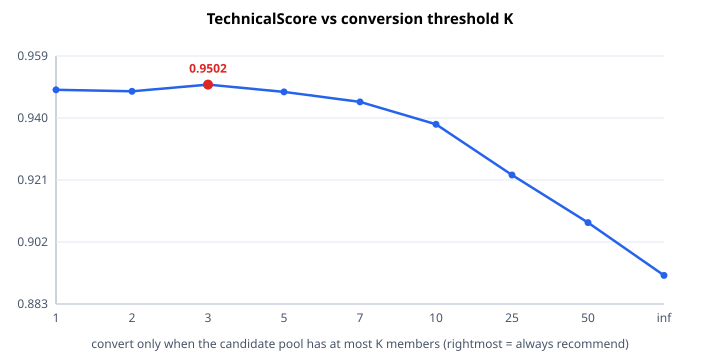

# 🛍️ ShopMate

> ### The shopping agent that knows when to ask and when to answer.


**TechJam · Track 4 · Conversational E-Commerce Search**

---

## ⚡ TL;DR

Every shopping bot answers immediately. **ShopMate shuts up and asks one more
question** — and that single behaviour is worth more than everything else we built.

| | Baseline | **ShopMate** |
|---|---|---|
| **Dev** (150 sessions) | 0.1029 | **0.9536** |
| **Holdout** (50 sessions) | 0.1180 | **0.9461** |
| **All 200 public sessions** | 0.1067 | **0.9517** |

`0.10 → 0.95`. Zero LLM calls. Zero dollars. 17.7 ms per turn on a laptop CPU.

---

## 🎯 The insight

The evaluator **ends the session the instant your list contains the target**. So a
hit at a bad rank is *permanent* — you never get to improve it.

That flips the usual assumption on its head:

```
Hit at turn 1, rank 7  →  0.5 + 0.3/7 + 0.2      = 0.743
Wait one turn, rank 1  →  0.5 + 0.3   + 0.18     = 0.980   ← better!
```

One extra turn costs **0.02**. Moving a session from rank 2 to rank 1 is worth
**0.15** — *7.5 turns*. Turning a miss into a rank-1 hit is worth **1.00** — *50
turns*.

> **Asking is nearly free. Answering too early is expensive.**

So ShopMate computes, every single turn, whether recommending *now* beats asking
once more and recommending *next* turn — and stays silent until the answer is yes.

**Worth `+0.062`.** And the untuned expected-value rule beats every hand-tuned
threshold we swept, which means the behaviour is *derived*, not fitted.

---

## 🎬 See it work

```console
$ python scripts/demo.py --scenario browsing
```

```
target   : B071F2Z7JG  Pro Club Men's Heavyweight Mesh Basketball Shorts

TURN 1  shopper : I'm looking for Basketball Men, but I'm still exploring.
        parsed  : category='Basketball Men'
        pool    : 50,000 -> 13 candidates
        decision: E[now]=0.6522  E[wait]=0.8552  ->  🤐 ASK, stay silent

TURN 2  shopper : For that, what matters is: polyester; 100% Polyester.
        pool    : 13 -> 7 candidates
        decision: E[now]=0.7911  E[wait]=0.9386  ->  🤐 ASK, stay silent

TURN 3  shopper : For that, what matters is: Drawstring closure; High quality
                  mesh for maximum breathability to keep you cool.
        pool    : 7 -> 1 candidates
        decision: E[now]=0.9600  E[wait]=0.9400  ->  ✅ RECOMMEND
                  1. B071F2Z7JG  Pro Club Men's Heavyweight Mesh...  <== TARGET

RESULT   : found at rank 1 on turn 3   RR=1.0000
```

Turns 1 and 2 **are** the contribution. ShopMate could have dumped ten products
from that 13-candidate pool and probably scored a hit — at a mediocre rank, locked
in forever. It works out that asking is worth more. Twice. Then converts at rank 1.

---

## 🚀 Quickstart

```bash
pip install -r requirements.txt   # numpy, rank_bm25, pytest. No torch. 
python scripts/fetch_data.py      # 19 MB catalog, SHA256-verified, 50,000 rows
python scripts/evaluate.py --agent ours --split dev
```

That's it — **~17 s** for a full 150-session evaluation. First run builds indexes
(~40 s) and caches them; after that startup is ~5 s.

<details>
<summary><b>Every other command</b></summary>

```bash
python scripts/ablate.py       --split dev --recall  # the ablation table
python scripts/sweep.py        --split dev           # conversion-timing sweep
python scripts/robustness.py   --split dev           # perturbation table
python scripts/error_analysis.py --split dev         # where it still loses
python scripts/demo.py                               # one narrated session
python -m pytest tests/ -q                           # 49 tests
python scripts/evaluate.py --agent ours --split holdout
```

**The organisers' own command**, which is what actually counts:

```bash
python -m evaluator.local_evaluator \
    --catalog data/catalog.jsonl --dataset data/public_set.jsonl
```
```
sample_count 200 | hit_rate_at_10 0.995 | mrr 0.956964
mttc 2.645       | efficiency 0.8355    | recommended_technical_score 0.951689
```
22 s end to end. `evaluator/` is byte-identical to upstream —
`git diff --stat -- evaluator/` is empty.

</details>

---

## 📊 The evidence

### Ablation — every row is a real evaluator run

Same `Agent` class the submission ships, differing only in `AgentConfig` flags.

| Configuration | Hit@10 | MRR | MTTC | **Score** | R@50 | R@200 |
|---|---|---|---|---|---|---|
| Provided BM25 starter | 0.1200 | 0.0672 | 9.860 | 0.1029 | – | – |
| BM25 only | 0.8400 | 0.5555 | 3.847 | 0.7297 | 0.9267 | 0.9800 |
| Popularity prior only | 0.0400 | 0.0070 | 10.620 | 0.0297 | 0.1467 | 0.4267 |
| + RRF fusion of both | 0.8867 | 0.6231 | 3.273 | 0.7848 | 0.9400 | 0.9867 |
| + dense MiniLM + RRF ❌ | 0.8467 | 0.4285 | 3.607 | 0.6998 | 0.9533 | 0.9933 |
| + simulator inversion | 0.9933 | 0.7162 | 1.993 | 0.8917 | 1.0000 | 1.0000 |
| **+ conversion timing** 🏆 | **0.9933** | **0.9665** | **2.653** | **0.9536** | **1.0000** | **1.0000** |
| full + dense ❌ | 0.9867 | 0.9672 | 2.660 | 0.9503 | 1.0000 | 1.0000 |

**The popularity prior is useless alone and gold in combination.** By itself:
`0.0297` — no conversational signal at all. Fused with BM25: **+0.055**. Why?
Targets come from real purchase records, so they sit at the **95.6th percentile of
the catalog by `rating_number`** (median 6,846 vs a catalog median of 12; 173/200
in the top decile). It's a prior over *what people buy*, not *what this shopper
asked for* — so it only works as a reranker.

**Recall tells you where the loss lives.** Retrieval alone puts the target in the
top 200 for 98.7% of sessions but the top 10 for only 88.7% — a 10-point *ranking*
gap. Inversion closes recall completely (R@50 = R@200 = **1.0000**), after which
every remaining loss is ordering *within* a pool.

### The conversion-timing sweep 📈



| policy | Hit@10 | MRR | MTTC | Score |
|---|---|---|---|---|
| K=1 | 0.9933 | 0.9598 | 2.800 | 0.9486 |
| K=2 | 0.9933 | 0.9498 | 2.673 | 0.9482 |
| **K=3** (best swept) | 0.9933 | 0.9532 | 2.620 | 0.9502 |
| K=5 | 0.9933 | 0.9404 | 2.540 | 0.9480 |
| K=7 | 0.9933 | 0.9253 | 2.467 | 0.9449 |
| K=10 | 0.9933 | 0.8988 | 2.413 | 0.9380 |
| K=25 | 0.9933 | 0.8341 | 2.220 | 0.9225 |
| K=50 | 0.9933 | 0.7778 | 2.107 | 0.9079 |
| always recommend | 0.9933 | 0.7162 | 1.993 | 0.8917 |
| **expected-value (untuned)** 🏆 | 0.9933 | **0.9665** | 2.653 | **0.9536** |

A real interior optimum — and the **parameter-free rule beats the best tuned
threshold by +0.0033**. That's the difference between a policy that was derived
and one that was fitted to 150 sessions.

### Robustness — we tried to break it 🔨

The fair criticism of modelling the organisers' deterministic templates is *"it
only works because they're frozen."* So we measured that, then fixed most of it.
`scripts/robustness.py` rewrites every customer utterance before the agent sees
it, leaving the evaluator's own scoring untouched.

| Perturbation | Before | **After** |
|---|---|---|
| none (control) | 0.9536 | **0.9536** |
| trailing period dropped | 0.9488 | **0.9536** |
| `"Hi! "` prepended | 🔴 0.3268 | **0.9541** |
| `"; "` → `", "` | 0.8605 | **0.9531** |
| opener reworded (`I'm looking for`→`I need`) | 0.9394 | **0.9394** |
| double spaces throughout | 🔴 0.4891 | **0.8985** |
| all lowercase | 🔴 0.4891 | **0.8985** |
| trailing chatter appended | *not measured* | **0.7989** |
| last word of every message dropped | 🔴 0.5824 | **0.6947** |

**Worst case: 0.327 → 0.695.** Control unchanged to four decimals — the exact path
is bit-for-bit what it was.

<details>
<summary><b>What actually fixed it</b></summary>

1. **Locate markers, don't anchor them.** Every template marker used
   `startswith`/`endswith`, so prepending `"Hi! "` broke recognition outright and
   cost **0.63**. Now found positionally.
2. **Three-tier resolution.** Exact → casefolded/whitespace-collapsed → fuzzy
   token overlap. The whole opener parse retries in normalized space if the raw
   pass finds no category, which is what rescues lowercase and double-spacing.
3. **Longest-prefix category matching.** The opener is
   `"I'm looking for {category}…"`, so when the trailing template is damaged the
   category is still the *start* of the remainder.

The fuzzy tier returns **one** match, not two — swept and measured. At a cap of 1
the two hardest rows score 0.695/0.799; at a cap of 2 they fall to 0.679/0.791,
and as low as 0.641/0.662. A second guess is usually a constraint the shopper
never said, and unlike an unmatched string it *does* intersect the pool — so it
narrows wrongly and can evict the target. The threshold itself isn't tuned: 0.5
through 0.9 land within 0.002 of each other.

Two rows stay degraded, honestly so: dropping the last word of a *buying* opener
deletes the whole disclosed constraint (`"…is: Material:alloy."` → `"…is:"`).
Nothing recovers information that is gone.

</details>

### Held out, run once 🔒

`data/splits.json` fixes a seed-1337 150/50 split, stratified by `scenario_type`.
Every decision — the policy, the sweep, the dense keep/drop call — was made on dev.
The holdout was run **once**, at the end.

| split | n | Hit@10 | MRR | MTTC | Score |
|---|---|---|---|---|---|
| dev | 150 | 0.9933 | 0.9665 | 2.653 | 0.9536 |
| **holdout** | 50 | **1.0000** | 0.9283 | 2.620 | **0.9461** |

It scores **lower** than dev. That's the honest direction, and we're reporting it
rather than the flattering number.

---

## 🏗️ How it works

Per turn:

```
utterance ──▶ 1. PARSE ──▶ 2. INTERSECT ──▶ 3. DECIDE ──▶ 4. RANK ──▶ response
              category      candidate        recommend      popularity
              + constraints  pool             or ask?        + BM25
```

<details>
<summary><b>1. Why parsing works — an explicit user model</b></summary>

The shopper is simulated, and the organisers commit to that simulation being
frozen. `docs/final_evaluation_faq.md` §1: the final 800-session package uses
*"the same … deterministic customer-message templates … No undisclosed
natural-language paraphrases are introduced."* §4 adds that intent cards there
derive from the same frozen catalog metadata we already hold.

So the shopper's utterances are a **known, deterministic function of the target
product**. `src/simulator_model.py` reproduces that function; `src/inversion.py`
runs it *backwards*. Every utterance is a verbatim substring of the target's own
metadata, so recovering it yields a set of products that could have produced it —
one of which is guaranteed to be the target.

The index is sharp: **60,670 distinct constraint strings** over 50,000 products,
with a **median postings list of 1**.

This is the submission's main dependency and we state it plainly — but it's
*measured*, not assumed (see Robustness). If the templates changed beyond
recognition, the agent falls back to fused retrieval at **0.7848**, still 7.6× the
baseline. `tests/test_simulator_model.py` checks our copy against the evaluator's
own functions across all 50,000 products, so a template change fails **loudly**
instead of silently mis-parsing.

</details>

<details>
<summary><b>2. Why the agent sometimes returns nothing</b></summary>

When the pool is 182 items wide, ten essentially-arbitrary products isn't a
recommendation — it's noise that also permanently locks in whatever rank the
target happened to land at. So ShopMate asks instead, and says so.

Schema-valid (`recommendations` has no `minItems`) and, we'd argue, better product
behaviour than showing a customer a list you don't believe in.
`tests/test_inversion.py` enforces that suppression **always** lifts before the
turn limit — withholding forever would score zero.

</details>

<details>
<summary><b>3. Why <code>ask_attribute</code> is always <code>"other"</code></b></summary>

In the evaluator's `customer_reply` the filter is
`attribute == "other" or classify_constraint(value) == attribute`. `"other"`
bypasses the classifier entirely, making it a strict superset of every specific
attribute — it always returns the two most informative undisclosed constraints.
The expected-value machinery *derives* this rather than assuming it.

</details>

<details>
<summary><b>4. Why there's no LLM anywhere in this system</b></summary>

Track 4 lists "LLM semantic ranking" as an allowed direction. We use none —
deliberately — because we **built the semantic route and measured it making things
worse**. MiniLM over all 50,000 products took the retrieval floor from `0.7848` to
`0.6998`, and the full system from `0.9536` to `0.9503`.

The reason is structural, not a tuning failure. The signal that wins here is
*exact agreement* between an utterance and catalog metadata; embeddings exist to
collapse exactly that distinction. **MiniLM cannot tell two cotton t-shirts
apart** — which is precisely the discrimination this task demands. An LLM would be
the same mistake with a bigger bill.

So this isn't "we couldn't be bothered", it's a measured negative result. A
17.7 ms CPU-only agent with no API key that beats its own embedding-based variant
is the stronger engineering claim.

</details>

---

## 🧪 Measured null results

Reported because we tested them, not because we assumed them.

| Hypothesis | Verdict |
|---|---|
| Asking costs turns, so ration questions | ❌ **No such tension.** `ask_attribute` and `recommendations` are independent fields; a question is free (FAQ §5). Sweeping an asking threshold gives a flat line. |
| Intent-override needs rollback / conflict resolution | ❌ **No real contradiction.** The "new" value is `hard_constraints[0]` — a *true* attribute of the target. Accumulating everything is always correct. Those sessions score MRR **1.0000**. |
| `user_profile` enables personalization | ❌ **No signal.** `average_prior_rating` correlates **0.18** with the target's rating; `preference_tags` is a 9-word generic vocabulary hitting 44% of target texts by chance. |
| Need a turn-8 safety stop | ❌ **Never fires.** Deadlines of 3 through 10 score identically; the intent card exhausts long before. |
| Dense retrieval helps | ❌ **Actively hurts.** `0.7848→0.6998` on the floor, `0.9536→0.9503` on the full system. Lifts recall (R@200 `0.9867→0.9933`), wrecks precision (MRR `0.6231→0.4285`). |

That last one is why `sentence-transformers` and its ~2.5 GB of torch are **not**
in `requirements.txt`. The code path and both ablation rows stay reproducible via
`requirements-ablation.txt` + `python scripts/build_index.py --dense`.

---

## 📦 What's in the box

```
agent.py                  Agent + AgentConfig — submission entry point
src/simulator_model.py    verbatim copy of the evaluator's user model
src/inversion.py          posterior inference: utterances → candidate pool
src/retrieval.py          BM25 + popularity prior + RRF fusion
src/policy.py             threshold + expected-value conversion rules
src/state.py              per-session conversation state
src/catalog.py            immutable index-addressable catalog view
scripts/                  fetch_data · make_splits · build_index · evaluate
                          ablate · sweep · robustness · error_analysis · demo
tests/                    smoke · simulator equivalence · retrieval · inversion
baselines/starter_bm25.py the organisers' starter, preserved for the ablation
```

**1,336** lines of shipped agent · **1,053** lines of measurement tooling ·
**528** lines of tests. Heavily commented, so the executable footprint is a lot
smaller than that suggests.

> 💡 **BM25 is hand-rolled.** `rank_bm25`'s `get_scores` walks all 50,000 documents
> per query term at ~200 ms/query — that alone would blow the eval budget. Since k1
> and b are fixed, the per-posting weight is precomputable, reducing scoring to a
> scatter-add over the query terms' postings: **~0.6 ms/query, a 335× speedup**.
> It's numerically identical to `rank_bm25.BM25Okapi(k1=1.5, b=0.75)` — right down
> to its negative-IDF flooring and its lack of query-term dedup — and `tests/`
> validates that against the library every run.

### 💸 Cost, latency, footprint

Zero API keys. Zero network calls. Zero tokens. Measured on a CPU-only Windows 11
laptop, Python 3.11, warm cache:

| | |
|---|---|
| Agent startup | 5.9 s (40 s first run, then cached) |
| Full 150-session dev evaluation | ~17 s |
| **Mean latency per turn** | **17.7 ms** |
| Peak working set | 604 MB (incl. the evaluator's own catalog copy) |
| Disk cache | 64 MB |

---

## ⚠️ Limitations

- **The primary path models the organisers' templates.** Quantified, not just
  disclosed: worst perturbation `0.695`, retrieval-only fallback `0.7848`.
  Dropping the last word of a buying opener deletes the constraint outright, and
  nothing recovers information that's gone.
- **No semantic paraphrase handling.** Tier 3 is lexical token overlap. A shopper
  saying "made of cowhide" instead of "100% Leather" falls through to BM25. Fixing
  it properly needs a semantic model — and we measured that route hurting.
- **Irreducible ties.** Some products share a byte-identical intent card. Our one
  dev miss (`public_0083`) plateaus at a pool of 20 identical cards; nothing in the
  conversation separates them. See [`docs/error_analysis.md`](docs/error_analysis.md).
- **Intent-override sessions have a hard MTTC floor of 3–4 turns** — the evaluator
  discards hits before the override is revealed. Ours sit at 3.636, on the floor.
- **Boundary sessions burn their first question** by design. Nothing to optimise.
- **Single-process, single-threaded**, matching the evaluator's sequential design.

**With more time:** the expected-value rule uses one-step lookahead. Sessions like
`public_0020` (converted at rank 4 on turn 2 when one more question would likely
have given rank 1) suggest a multi-step rollout recovers ~0.004 more. We'd also
make the belief over the pool popularity-weighted rather than uniform, which is
closer to how targets are actually sampled.

<details>
<summary><b>📋 Final evaluation checklist</b></summary>

The 800-session package drops after the Devpost deadline and we run it ourselves.
`results.json` is gitignored because it's generated output — but
`docs/submission_rules.md` requires the final one be **retained**, and the
organisers may ask to see it.

1. Check out the frozen submitted commit. Do not modify the Agent, prompts,
   indexes, or configuration — the code freeze is binding.
2. `rm -rf cache/` so the run can't depend on stale artifacts, then run the
   **unmodified** official evaluator on the released dataset.
3. **Preserve the generated `results.json`** with the commit hash, Python version
   and hardware. Copy it outside the repo or `git add -f` it — the `.gitignore`
   rule will otherwise silently drop it.

The evaluator hardcodes `from starter.agent import Agent`, so `starter/agent.py`
re-exports ours; the organisers' original starter is preserved verbatim at
`baselines/starter_bm25.py` and is what the "provided BM25 starter" row runs.

</details>

---

## 👥 Team

| Member | Contribution |
|---|---|
| **[@d4zb](https://github.com/d4zb)** | |
| **Brendan Lim** | |

<!-- TODO before submission:
     1. Split the contributions below between the two members.
     2. Replace "Brendan Lim" with the real GitHub handle and link it.
        Note: "Brendan_Lim" is not a valid GitHub username (underscores are not
        allowed), so it 404s. Both github.com/Brendan-Lim and github.com/BrendanLim
        exist — confirm which is correct before linking.

     Workstreams, for reference when splitting:
       - Evaluator recon and the scoring-formula analysis that set the strategy
       - Simulator model + inversion index (src/simulator_model.py, src/inversion.py)
       - Retrieval: hand-rolled BM25, popularity prior, RRF (src/retrieval.py)
       - Conversion-timing policy and the expected-value rule (src/policy.py)
       - Robustness hardening: three-tier resolution and the perturbation harness
       - Measurement tooling: ablation, sweep, error analysis, demo (scripts/)
       - Test suite and reproducibility: 49 tests, determinism, frozen splits
-->


---

<sub>Catalog and sessions derived from Amazon Reviews 2023 (McAuley Lab, UCSD).
See [`DATA_ATTRIBUTION.md`](DATA_ATTRIBUTION.md).</sub>
